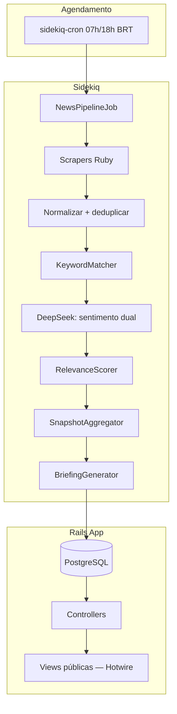

# Painel de Humor do Ecossistema RS — Design Spec

**Data:** 2026-06-20  
**Status:** Aprovado (brainstorming) — revisão Rails + DeepSeek  
**Autor:** Projeto pessoal (dados abertos, painel público)

---

## 1. Visão geral

Painel web **público** que monitora manchetes de portais gaúchos sobre temas de interesse em **gestão pública**, classifica o **humor** (positivo, neutro, negativo) com duas lentes analíticas, destaca **pontos críticos** na interface e apresenta as **3 notícias mais relevantes do dia** com resumo gerado por IA.

Não é ferramenta institucional: sem autenticação, sem alertas por e-mail/WhatsApp. Notificações futuras para a Secretaria da SPGG ficam fora de escopo (fase futura opcional).

### Objetivos

1. Agrupar notícias por palavras-chave fixas (MVP).
2. Exibir humor agregado por tema (cards + gráfico 7 dias).
3. Sinalizar visualmente temas críticos (card vermelho).
4. Oferecer leitura rápida via Top 3 + resumos.
5. Publicar dados de forma aberta (export JSON/CSV em fase 1.5).

### Fora de escopo (MVP)

- Login, perfis, RBAC
- E-mail, WhatsApp, Telegram, push
- Painel admin de keywords
- Histórico além de 7 dias / arquivo por calendário
- Integração com sistemas do Estado

---

## 2. Decisões de produto (consolidadas)

| Decisão | Escolha |
|---------|---------|
| Acesso | Público, sem autenticação |
| Uso | Painel informativo pessoal; dados abertos |
| Alertas | Apenas visual (cards vermelhos) |
| Sentimento | Dual: institucional (gov/RS) + temático (keyword) |
| Fontes | G1 RS, Zero Hora, Correio do Povo, Gaúcha ZH, ANP, Sul21, Agência Brasil (filtro RS) |
| Keywords | Lista fixa (18 termos); alteração via deploy |
| Histórico | Snapshot do dia + gráfico linha 7 dias por keyword |
| Atualização | 2×/dia — 07:00 e 18:00 (horário de Brasília) |
| Stack | **Rails monolito** + Sidekiq + PostgreSQL |
| Infra | Nuvem pública; LLM externo permitido |
| LLM | **DeepSeek API** (`deepseek-v4-flash`) |

---

## 3. Arquitetura recomendada

**Opção escolhida:** Monolito **Ruby on Rails** — scraping, jobs, análise LLM, persistência e dashboard em uma única aplicação.



### Por que Rails monolito

| Vantagem | Detalhe |
|----------|---------|
| Um repo, um deploy | Scraping + jobs + UI sem microserviços |
| Sidekiq | Jobs robustos com retry, fila e cron (`sidekiq-cron`) |
| Scraping maduro | `feedjira` (RSS) + `nokogiri` (HTML) + `faraday` |
| Dashboard integrado | Views Rails + Turbo; sem Next.js separado |
| Custo | 1 web + 1 worker + Postgres |

### Alternativas descartadas

| Opção | Motivo da rejeição |
|-------|-------------------|
| Python + FastAPI + Next.js | Substituída por monolito Rails (menos peças, mesmo domínio) |
| Monolito Next.js serverless | Scraping frágil; timeout em 7 fontes |
| Site estático + JSON | Histórico e alertas visuais limitados |
| Cloudflare Workers (TS) | Reescrita completa; CPU limitada no free tier |

### Stack

| Camada | Tecnologia |
|--------|------------|
| Framework | Ruby on Rails 7.2+ |
| Coleta | `feedjira`, `nokogiri`, `faraday` |
| Jobs | Sidekiq + `sidekiq-cron` + Redis |
| NLP / resumos | **DeepSeek API** (`deepseek-v4-flash`; gem `ruby-openai`) |
| Banco | PostgreSQL 16 + ActiveRecord |
| Frontend | ERB/Hotwire (Turbo Frames) + Tailwind + Chartkick |
| Cache/fila | Redis (Sidekiq) |
| Deploy | Render / Railway / Fly.io (web + worker) |

**Custo operacional estimado:** US$ 5–12/mês (web + worker free tier ou ~US$7 + Redis + DeepSeek ~US$0,50–2/mês).

### Estrutura da aplicação

```
app/
├── models/
│   ├── source.rb
│   ├── keyword.rb
│   ├── article.rb
│   ├── article_analysis.rb
│   ├── daily_snapshot.rb
│   └── daily_briefing.rb
├── services/
│   ├── news_pipeline.rb
│   ├── keyword_matcher.rb
│   ├── sentiment_analyzer.rb      # DeepSeek
│   ├── relevance_scorer.rb
│   ├── snapshot_aggregator.rb
│   └── briefing_generator.rb
├── scrapers/
│   ├── base_scraper.rb
│   ├── g1_rs_scraper.rb
│   ├── zero_hora_scraper.rb
│   └── ... (um por fonte)
├── jobs/
│   └── news_pipeline_job.rb
└── controllers/
    ├── dashboard_controller.rb    # home pública
    ├── keywords_controller.rb     # drill-down
    └── about_controller.rb        # fase 1.5
```

---

## 4. Fontes de dados

| Portal | Método preferencial | Seção / filtro |
|--------|---------------------|----------------|
| G1 RS | RSS / scraping | Política / Rio Grande do Sul |
| Zero Hora | RSS / scraping | Política |
| Correio do Povo | RSS / scraping | Política |
| Gaúcha ZH | RSS / scraping | Política |
| ANP | Scraping | Política / RS |
| Sul21 | RSS / scraping | Política |
| Agência Brasil | RSS | Tag/filtro "Rio Grande do Sul" |

Cada coletor retorna: `title`, `url`, `published_at`, `source_id`, `section` (opcional).

---

## 5. Palavras-chave (lista definitiva — MVP)

18 termos monitorados (lista fixa; alteração via deploy):

| # | Termo |
|---|-------|
| 1 | acordo de resultados |
| 2 | projetos estratégicos |
| 3 | plano plurianual |
| 4 | ppa rs |
| 5 | modernização administrativa |
| 6 | reforma administrativa |
| 7 | eficiência na gestão |
| 8 | governo digital |
| 9 | rs.gov.br |
| 10 | inovação no setor público |
| 11 | funcionalismo público |
| 12 | servidores estaduais |
| 13 | concurso público rs |
| 14 | patrimônio do estado |
| 15 | parcerias público-privadas |
| 16 | ppp rs |
| 17 | concessões públicas |
| 18 | spgg |

### Sinônimos sugeridos no seed (matching ampliado)

| Termo principal | Sinônimos / variantes |
|-------------------|----------------------|
| ppa rs | ppa, plano plurianual rs |
| parcerias público-privadas | ppp, parceria público-privada |
| ppp rs | ppp, parcerias público-privadas |
| rs.gov.br | portal rs gov |
| spgg | secretaria de planejamento governança e gestão |
| concurso público rs | concurso público, concurso rs |
| eficiência na gestão | eficiência, gestão eficiente |

Matching: busca case-insensitive no título e snippet; sinônimos configurados no seed JSON/SQL.

---

## 6. Modelo de análise de sentimento

Cada par `(artigo, keyword)` recebe duas classificações:

| Lente | Pergunta |
|-------|----------|
| **Institucional** | A manchete é favorável, neutra ou desfavorável à gestão pública / governo do RS? |
| **Temática** | O tema da keyword está sendo recebido positiva, neutra ou negativamente? |

Valores: `positive` | `neutral` | `negative`.

Prompt LLM estruturado (JSON output) com manchete + keyword + contexto opcional (lead de 1 parágrafo se disponível).

### Provedor: DeepSeek API

| Parâmetro | Valor |
|-----------|-------|
| Endpoint | `https://api.deepseek.com` |
| Modelo (MVP) | `deepseek-v4-flash` — rápido e barato para classificação + resumos |
| Modelo (opcional) | `deepseek-v4-pro` — maior qualidade em resumos executivos, se necessário |
| SDK | Gem `ruby-openai` com `uri_base: "https://api.deepseek.com"` |
| Env vars | `DEEPSEEK_API_KEY`, `DEEPSEEK_MODEL` (default: `deepseek-v4-flash`) |
| Output | `response_format: { type: "json_object" }` para sentimento dual |

Exemplo de configuração (Ruby — stack principal):

```ruby
# config/initializers/deepseek.rb
DeepseekClient = OpenAI::Client.new(
  access_token: ENV.fetch("DEEPSEEK_API_KEY"),
  uri_base: ENV.fetch("DEEPSEEK_BASE_URL", "https://api.deepseek.com")
)

# app/services/sentiment_analyzer.rb
response = DeepseekClient.chat(
  parameters: {
    model: ENV.fetch("DEEPSEEK_MODEL", "deepseek-v4-flash"),
    response_format: { type: "json_object" },
    messages: [
      { role: "system", content: "..." },
      { role: "user", content: prompt }
    ]
  }
)
```

**Nota:** aliases legados `deepseek-chat` e `deepseek-reasoner` serão descontinuados em jul/2026 — usar apenas `deepseek-v4-flash` ou `deepseek-v4-pro`.

---

## 7. Score de relevância (Top 3 e alerta de impacto)

Score 0–100 por artigo:

| Fator | Peso |
|-------|------|
| Recência (horas desde publicação) | 25% |
| Keyword no título | 25% |
| Aparece em 2+ fontes (mesmo fato) | 25% |
| Magnitude de sentimento negativo (dual) | 25% |

**Top 3 do dia:** 3 artigos com maior score entre todos os matches do ciclo (07h ou 18h).

Cada Top 3 inclui resumo de 2–3 frases gerado por LLM.

---

## 8. Lógica de ponto crítico (card vermelho)

Um card de keyword fica **crítico** (`is_critical = true`) se **qualquer** condição for verdadeira na janela desde a coleta anterior:

### Gatilho A — Volume

≥ 60% das manchetes matched na keyword com sentimento **temático** ou **institucional** negativo.

Com atualização 2×/dia, a janela natural é ~12 h (07h→18h) ou ~19 h (18h→07h).

### Gatilho B — Impacto

1 manchete com:

- `relevance_score >= 70`, e  
- sentimento negativo em **ambas** as lentes (institucional **e** temático).

### Representação visual

- Card normal: borda neutra; indicador verde/amarelo/vermelho por % negativo do dia  
- Card crítico: borda vermelha, badge "Atenção", ícone de alerta  
- Manchete de alto impacto listada com destaque no detalhe da keyword

---

## 9. Modelo de dados (ActiveRecord)

Schema equivalente via migrations Rails:

```ruby
# db/migrate/..._create_sources.rb
create_table :sources do |t|
  t.string :slug, null: false, index: { unique: true }
  t.string :name, null: false
  t.text :base_url, null: false
  t.string :fetch_type, null: false  # rss | scrape
  t.jsonb :fetch_config, null: false, default: {}
  t.timestamps
end

# keywords
create_table :keywords do |t|
  t.string :term, null: false, index: { unique: true }
  t.string :synonyms, array: true, default: []
  t.timestamps
end

# articles
create_table :articles do |t|
  t.references :source, null: false, foreign_key: true
  t.text :title, null: false
  t.text :url, null: false, index: { unique: true }
  t.datetime :published_at
  t.text :content_snippet
  t.timestamps
end
t.index :collected_at  # via created_at or explicit collected_at

# article_analyses
create_table :article_analyses do |t|
  t.references :article, null: false, foreign_key: true
  t.references :keyword, null: false, foreign_key: true
  t.string :sentiment_institutional, null: false
  t.string :sentiment_thematic, null: false
  t.integer :relevance_score, null: false
  t.timestamps
end
add_index :article_analyses, [:article_id, :keyword_id], unique: true

# daily_snapshots
create_table :daily_snapshots do |t|
  t.date :snapshot_date, null: false
  t.string :slot, null: false  # manha | tarde
  t.references :keyword, null: false, foreign_key: true
  t.decimal :pct_positive, precision: 5, scale: 2, null: false
  t.decimal :pct_neutral, precision: 5, scale: 2, null: false
  t.decimal :pct_negative, precision: 5, scale: 2, null: false
  t.integer :article_count, null: false
  t.boolean :is_critical, null: false, default: false
  t.timestamps
end
add_index :daily_snapshots, [:snapshot_date, :slot, :keyword_id], unique: true, name: "idx_snapshots_date_slot_keyword"

# daily_briefings
create_table :daily_briefings do |t|
  t.date :briefing_date, null: false
  t.string :slot, null: false
  t.jsonb :items, null: false, default: []
  t.timestamps
end
add_index :daily_briefings, [:briefing_date, :slot], unique: true
```

---

## 10. Rotas e interface (Rails)

### Rotas públicas

| Método | Rota | Controller#action | Descrição |
|--------|------|-------------------|-----------|
| GET | `/` | `dashboard#index` | Home — Top 3, cards, gráfico 7d |
| GET | `/keywords/:id` | `keywords#show` | Drill-down por keyword |
| GET | `/about` | `about#show` | Metodologia + fontes (fase 1.5) |
| GET | `/export/snapshots.json` | `exports#snapshots` | Dados abertos (fase 1.5) |

Sem autenticação. `rack-attack` para rate limiting básico (ex.: 60 req/min por IP).

### API JSON opcional (fase 1.5)

Endpoints JSON em `namespace :api` para consumo externo — mesma lógica dos controllers HTML, formato `jbuilder` ou `blueprint`.

---

## 11. Interface do painel

### 11.1 Home

```
┌──────────────────────────────────────────────────────────┐
│  Humor do Ecossistema RS          Atualizado: 20/06 18:00 │
├──────────────────────────────────────────────────────────┤
│  LEITURA RÁPIDA — TOP 3                                   │
│  1. [resumo IA] · G1 RS · link                           │
│  2. ...                                                   │
│  3. ...                                                   │
├──────────────────────────────────────────────────────────┤
│  [Card PPP 🔴]  [Card Reforma 🟡]  [Card PPP ...]       │
│  72% neg · 12 matérias    45% neg · 8 matérias           │
├──────────────────────────────────────────────────────────┤
│  Gráfico 7 dias — % negativo por keyword (linhas)        │
└──────────────────────────────────────────────────────────┘
```

### 11.2 Detalhe da keyword

- Título da keyword + status crítico  
- Lista de manchetes do ciclo/dia com badges institucional + temático  
- Manchetes de alto impacto com highlight  
- Link externo para matéria original  

### 11.3 Rodapé / Sobre (fase 1.5)

- Metodologia de sentimento  
- Fontes monitoradas  
- Link export JSON  

### Design visual

- **Tailwind CSS** via `tailwindcss-rails`  
- **Chartkick** + Chart.js para gráfico 7 dias  
- Paleta sóbria (tons institucionais, não identidade visual gov)  
- Verde / amarelo / vermelho para sentimento  
- Responsivo (mobile-first)  
- Acessibilidade: contraste WCAG AA, labels em gráficos  

---

## 12. Pipeline de execução (Sidekiq — 2×/dia)

### Agendamento (`config/schedule.yml` — sidekiq-cron)

```yaml
news_pipeline_morning:
  cron: "0 10 * * *"    # 07:00 BRT (UTC-3 → 10:00 UTC)
  class: NewsPipelineJob
  args: ["manha"]

news_pipeline_evening:
  cron: "0 21 * * *"    # 18:00 BRT → 21:00 UTC
  class: NewsPipelineJob
  args: ["tarde"]
```

### Fluxo do `NewsPipelineJob`

| Etapa | Service / classe |
|-------|------------------|
| 1. Coletar | `Scrapers::*` via `NewsPipeline#collect` |
| 2. Deduplicar | `Article.find_or_create_by!(url:)` |
| 3. Match keywords | `KeywordMatcher` |
| 4. Sentimento dual | `SentimentAnalyzer` (DeepSeek) |
| 5. Score relevância | `RelevanceScorer` |
| 6. Agregar snapshots | `SnapshotAggregator` |
| 7. Top 3 + resumos | `BriefingGenerator` (DeepSeek) |

| Horário (BRT) | Slot | Passos |
|---------------|------|--------|
| 07:00 | `manha` | Job completo |
| 18:00 | `tarde` | Job completo (matérias novas) |

**Timeout Sidekiq:** 30 min (`sidekiq_options retry: 3`). Se volume de LLM crescer, quebrar em jobs encadeados: `CollectJob` → `AnalyzeJob` → `AggregateJob`.

Entre runs, o dashboard exibe último snapshot (sem polling).

### Tratamento de erros

| Falha | Comportamento |
|-------|---------------|
| Fonte indisponível | Log + Sentry; continua demais fontes; badge "fonte parcial" |
| DeepSeek timeout | Retry 2× no service; fallback sentimento `neutral` |
| Job falha | Sidekiq retry (3×); alerta no log |
| Zero artigos | Snapshot `article_count: 0`; card cinza "sem cobertura" |
| Duplicata URL | `rescue ActiveRecord::RecordNotUnique` — ignorar |

---

## 13. Deploy

```
Render / Railway / Fly.io
├── web process     → bin/rails server (dashboard público)
├── worker process  → bundle exec sidekiq
├── PostgreSQL      → addon ou Neon free
└── Redis           → addon ou Upstash free (Sidekiq)
```

Variáveis de ambiente: `DATABASE_URL`, `REDIS_URL`, `DEEPSEEK_API_KEY`, `DEEPSEEK_MODEL`, `RAILS_MASTER_KEY`.

**Sem GitHub Actions** para cron — agendamento interno via `sidekiq-cron`.

---

## 14. Segurança e compliance

- Respeitar `robots.txt` e termos de uso dos portais  
- User-Agent identificável com URL do projeto  
- Rate limit nos coletores (≥ 2 s entre requests por domínio)  
- Não armazenar conteúdo integral paywalled — apenas manchete + snippet público  
- `DEEPSEEK_API_KEY` em variáveis de ambiente (nunca no código)  

---

## 15. Critérios de sucesso (MVP)

1. Pipeline roda 2×/dia sem intervenção manual por 7 dias consecutivos.  
2. Home exibe Top 3, cards por keyword e gráfico 7 dias.  
3. Card fica vermelho corretamente nos cenários A e B (testes unitários + fixture).  
4. Tempo de carregamento da home < 3 s (P95).  
5. Export JSON disponível (fase 1.5).

---

## 16. Roadmap pós-MVP

| Fase | Entrega |
|------|---------|
| 1.5 | Página Sobre, export JSON/CSV, Open Graph para compartilhamento |
| 2 | Painel admin de keywords; histórico 30 dias |
| 3 | Alertas e-mail/WhatsApp (se retomar uso institucional) |
| 4 | API pública documentada (OpenAPI) |

---

## 17. Glossário

| Termo | Definição |
|-------|-----------|
| Humor | Sentimento agregado das manchetes (positivo/neutro/negativo) |
| Ecossistema | Conjunto de portais e narrativas midiáticas gaúchas sobre gestão pública |
| Slot | Ciclo de coleta (`manha` 07h ou `tarde` 18h) |
| Ponto crítico | Keyword em estado de alerta visual (card vermelho) |
