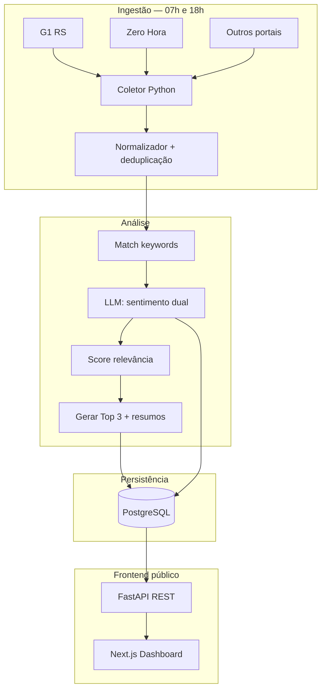

# Painel de Humor do Ecossistema RS — Design Spec

**Data:** 2026-06-20  
**Status:** Aprovado (brainstorming)  
**Autor:** Projeto pessoal (dados abertos, painel público)

---

## 1. Visão geral

Painel web **público** que monitora manchetes de portais gaúchos sobre temas de interesse em **gestão pública**, classifica o **humor** (positivo, neutro, negativo) com duas lentes analíticas, destaca **pontos críticos** na interface e apresenta as **3 notícias mais relevantes do dia** com resumo gerado por IA.

Não é ferramenta institucional: sem autenticação, sem alertas por e-mail/WhatsApp. Notificações futuras para a Secretaria da SPGG ficam fora de escopo (fase futura opcional).

### Objetivos

1. Agrupar notícias por palavras-chave fixas (MVP).
2. Exibir humor agregado por tema (cards + gráfico 7 dias).
3. Sinalizar visualmente temas críticos (card vermelho).
4. Oferecer leitura rápida via Top 3 + resumos.
5. Publicar dados de forma aberta (export JSON/CSV em fase 1.5).

### Fora de escopo (MVP)

- Login, perfis, RBAC
- E-mail, WhatsApp, Telegram, push
- Painel admin de keywords
- Histórico além de 7 dias / arquivo por calendário
- Integração com sistemas do Estado

---

## 2. Decisões de produto (consolidadas)

| Decisão | Escolha |
|---------|---------|
| Acesso | Público, sem autenticação |
| Uso | Painel informativo pessoal; dados abertos |
| Alertas | Apenas visual (cards vermelhos) |
| Sentimento | Dual: institucional (gov/RS) + temático (keyword) |
| Fontes | G1 RS, Zero Hora, Correio do Povo, Gaúcha ZH, ANP, Sul21, Agência Brasil (filtro RS) |
| Keywords | Lista fixa (18 termos); alteração via deploy |
| Histórico | Snapshot do dia + gráfico linha 7 dias por keyword |
| Atualização | 2×/dia — 07:00 e 18:00 (horário de Brasília) |
| Infra | Nuvem pública; LLM externo permitido |

---

## 3. Arquitetura recomendada

**Opção escolhida:** Pipeline Python + API FastAPI + Dashboard Next.js + PostgreSQL.



### Alternativas descartadas

| Opção | Motivo da rejeição |
|-------|-------------------|
| Monolito Next.js | Scraping frágil em serverless; timeout em 7 fontes |
| Site estático + JSON | Sem histórico/alertas visuais robustos; validação apenas |

### Stack

| Camada | Tecnologia |
|--------|------------|
| Coleta | Python 3.12, `feedparser`, `httpx`, BeautifulSoup4 |
| NLP / resumos | OpenAI API (GPT-4o-mini ou equivalente) |
| API | FastAPI |
| Banco | PostgreSQL 16 |
| Frontend | Next.js 14, Tailwind CSS, Recharts |
| Agendamento | Cron no VPS ou GitHub Actions |
| Deploy | Railway / Render / AWS Lightsail |

**Custo operacional estimado:** US$ 15–40/mês (hosting + ~2 runs/dia × análise LLM).

---

## 4. Fontes de dados

| Portal | Método preferencial | Seção / filtro |
|--------|---------------------|----------------|
| G1 RS | RSS / scraping | Política / Rio Grande do Sul |
| Zero Hora | RSS / scraping | Política |
| Correio do Povo | RSS / scraping | Política |
| Gaúcha ZH | RSS / scraping | Política |
| ANP | Scraping | Política / RS |
| Sul21 | RSS / scraping | Política |
| Agência Brasil | RSS | Tag/filtro "Rio Grande do Sul" |

Cada coletor retorna: `title`, `url`, `published_at`, `source_id`, `section` (opcional).

---

## 5. Palavras-chave (lista definitiva — MVP)

18 termos monitorados (lista fixa; alteração via deploy):

| # | Termo |
|---|-------|
| 1 | acordo de resultados |
| 2 | projetos estratégicos |
| 3 | plano plurianual |
| 4 | ppa rs |
| 5 | modernização administrativa |
| 6 | reforma administrativa |
| 7 | eficiência na gestão |
| 8 | governo digital |
| 9 | rs.gov.br |
| 10 | inovação no setor público |
| 11 | funcionalismo público |
| 12 | servidores estaduais |
| 13 | concurso público rs |
| 14 | patrimônio do estado |
| 15 | parcerias público-privadas |
| 16 | ppp rs |
| 17 | concessões públicas |
| 18 | spgg |

### Sinônimos sugeridos no seed (matching ampliado)

| Termo principal | Sinônimos / variantes |
|-------------------|----------------------|
| ppa rs | ppa, plano plurianual rs |
| parcerias público-privadas | ppp, parceria público-privada |
| ppp rs | ppp, parcerias público-privadas |
| rs.gov.br | portal rs gov |
| spgg | secretaria de planejamento governança e gestão |
| concurso público rs | concurso público, concurso rs |
| eficiência na gestão | eficiência, gestão eficiente |

Matching: busca case-insensitive no título e snippet; sinônimos configurados no seed JSON/SQL.

---

## 6. Modelo de análise de sentimento

Cada par `(artigo, keyword)` recebe duas classificações:

| Lente | Pergunta |
|-------|----------|
| **Institucional** | A manchete é favorável, neutra ou desfavorável à gestão pública / governo do RS? |
| **Temática** | O tema da keyword está sendo recebido positiva, neutra ou negativamente? |

Valores: `positive` | `neutral` | `negative`.

Prompt LLM estruturado (JSON output) com manchete + keyword + contexto opcional (lead de 1 parágrafo se disponível).

---

## 7. Score de relevância (Top 3 e alerta de impacto)

Score 0–100 por artigo:

| Fator | Peso |
|-------|------|
| Recência (horas desde publicação) | 25% |
| Keyword no título | 25% |
| Aparece em 2+ fontes (mesmo fato) | 25% |
| Magnitude de sentimento negativo (dual) | 25% |

**Top 3 do dia:** 3 artigos com maior score entre todos os matches do ciclo (07h ou 18h).

Cada Top 3 inclui resumo de 2–3 frases gerado por LLM.

---

## 8. Lógica de ponto crítico (card vermelho)

Um card de keyword fica **crítico** (`is_critical = true`) se **qualquer** condição for verdadeira na janela desde a coleta anterior:

### Gatilho A — Volume

≥ 60% das manchetes matched na keyword com sentimento **temático** ou **institucional** negativo.

Com atualização 2×/dia, a janela natural é ~12 h (07h→18h) ou ~19 h (18h→07h).

### Gatilho B — Impacto

1 manchete com:

- `relevance_score >= 70`, e  
- sentimento negativo em **ambas** as lentes (institucional **e** temático).

### Representação visual

- Card normal: borda neutra; indicador verde/amarelo/vermelho por % negativo do dia  
- Card crítico: borda vermelha, badge "Atenção", ícone de alerta  
- Manchete de alto impacto listada com destaque no detalhe da keyword

---

## 9. Modelo de dados

```sql
-- Fontes de notícia
CREATE TABLE sources (
    id SERIAL PRIMARY KEY,
    slug VARCHAR(50) UNIQUE NOT NULL,
    name VARCHAR(100) NOT NULL,
    base_url TEXT NOT NULL,
    fetch_type VARCHAR(20) NOT NULL, -- 'rss' | 'scrape'
    fetch_config JSONB NOT NULL DEFAULT '{}'
);

-- Keywords monitoradas
CREATE TABLE keywords (
    id SERIAL PRIMARY KEY,
    term VARCHAR(100) UNIQUE NOT NULL,
    synonyms TEXT[] NOT NULL DEFAULT '{}'
);

-- Artigos coletados
CREATE TABLE articles (
    id SERIAL PRIMARY KEY,
    source_id INT NOT NULL REFERENCES sources(id),
    title TEXT NOT NULL,
    url TEXT UNIQUE NOT NULL,
    published_at TIMESTAMPTZ,
    collected_at TIMESTAMPTZ NOT NULL DEFAULT NOW(),
    content_snippet TEXT
);

-- Análise por artigo + keyword
CREATE TABLE article_analyses (
    id SERIAL PRIMARY KEY,
    article_id INT NOT NULL REFERENCES articles(id),
    keyword_id INT NOT NULL REFERENCES keywords(id),
    sentiment_institutional VARCHAR(10) NOT NULL,
    sentiment_thematic VARCHAR(10) NOT NULL,
    relevance_score INT NOT NULL,
    UNIQUE (article_id, keyword_id)
);

-- Snapshot agregado por keyword e ciclo
CREATE TABLE daily_snapshots (
    id SERIAL PRIMARY KEY,
    snapshot_date DATE NOT NULL,
    slot VARCHAR(10) NOT NULL, -- 'manha' | 'tarde'
    keyword_id INT NOT NULL REFERENCES keywords(id),
    pct_positive NUMERIC(5,2) NOT NULL,
    pct_neutral NUMERIC(5,2) NOT NULL,
    pct_negative NUMERIC(5,2) NOT NULL,
    article_count INT NOT NULL,
    is_critical BOOLEAN NOT NULL DEFAULT FALSE,
    UNIQUE (snapshot_date, slot, keyword_id)
);

-- Briefing Top 3
CREATE TABLE daily_briefings (
    id SERIAL PRIMARY KEY,
    briefing_date DATE NOT NULL,
    slot VARCHAR(10) NOT NULL,
    items JSONB NOT NULL, -- [{article_id, rank, summary, title, url, source, sentiments}]
    generated_at TIMESTAMPTZ NOT NULL DEFAULT NOW(),
    UNIQUE (briefing_date, slot)
);
```

---

## 10. API REST (público)

| Método | Endpoint | Descrição |
|--------|----------|-----------|
| GET | `/api/health` | Status do serviço |
| GET | `/api/briefing/latest` | Top 3 + metadados do último ciclo |
| GET | `/api/snapshots/latest` | Cards de todas as keywords (último slot) |
| GET | `/api/snapshots/history/{keyword_id}?days=7` | Série temporal para gráfico |
| GET | `/api/keywords/{id}/articles?date=YYYY-MM-DD` | Manchetes do dia para drill-down |
| GET | `/api/meta/sources` | Lista de fontes (transparência) |
| GET | `/api/export/snapshots.json` | Dados abertos (fase 1.5) |

Sem autenticação. Rate limiting básico (ex.: 60 req/min por IP) para proteção.

---

## 11. Interface do painel

### 11.1 Home

```
┌──────────────────────────────────────────────────────────┐
│  Humor do Ecossistema RS          Atualizado: 20/06 18:00 │
├──────────────────────────────────────────────────────────┤
│  LEITURA RÁPIDA — TOP 3                                   │
│  1. [resumo IA] · G1 RS · link                           │
│  2. ...                                                   │
│  3. ...                                                   │
├──────────────────────────────────────────────────────────┤
│  [Card PPP 🔴]  [Card Reforma 🟡]  [Card PPP ...]       │
│  72% neg · 12 matérias    45% neg · 8 matérias           │
├──────────────────────────────────────────────────────────┤
│  Gráfico 7 dias — % negativo por keyword (linhas)        │
└──────────────────────────────────────────────────────────┘
```

### 11.2 Detalhe da keyword

- Título da keyword + status crítico  
- Lista de manchetes do ciclo/dia com badges institucional + temático  
- Manchetes de alto impacto com highlight  
- Link externo para matéria original  

### 11.3 Rodapé / Sobre (fase 1.5)

- Metodologia de sentimento  
- Fontes monitoradas  
- Link export JSON  

### Design visual

- Paleta sóbria (tons institucionais, não identidade visual gov)  
- Verde / amarelo / vermelho para sentimento  
- Responsivo (mobile-first para consulta rápida)  
- Acessibilidade: contraste WCAG AA, labels em gráficos  

---

## 12. Pipeline de execução (2×/dia)

| Horário (BRT) | Slot | Passos |
|---------------|------|--------|
| 07:00 | `manha` | Coletar → deduplicar → match → LLM → agregar → Top 3 → persistir |
| 18:00 | `tarde` | Idem (artigos novos desde manhã) |

Entre runs, frontend exibe último snapshot disponível (sem polling).

### Tratamento de erros

| Falha | Comportamento |
|-------|---------------|
| Fonte indisponível | Log + continua demais fontes; badge "fonte parcial" no meta |
| LLM timeout | Retry 2×; se falhar, sentimento `neutral` + flag `analysis_pending` |
| Zero artigos | Snapshot com `article_count=0`; card cinza "sem cobertura" |
| Duplicata URL | Ignorar (constraint unique) |

---

## 13. Segurança e compliance

- Respeitar `robots.txt` e termos de uso dos portais  
- User-Agent identificável com URL do projeto  
- Rate limit nos coletores (≥ 2 s entre requests por domínio)  
- Não armazenar conteúdo integral paywalled — apenas manchete + snippet público  
- API keys em variáveis de ambiente  

---

## 14. Critérios de sucesso (MVP)

1. Pipeline roda 2×/dia sem intervenção manual por 7 dias consecutivos.  
2. Home exibe Top 3, cards por keyword e gráfico 7 dias.  
3. Card fica vermelho corretamente nos cenários A e B (testes unitários + fixture).  
4. Tempo de carregamento da home < 3 s (P95).  
5. Export JSON disponível (fase 1.5).

---

## 15. Roadmap pós-MVP

| Fase | Entrega |
|------|---------|
| 1.5 | Página Sobre, export JSON/CSV, Open Graph para compartilhamento |
| 2 | Painel admin de keywords; histórico 30 dias |
| 3 | Alertas e-mail/WhatsApp (se retomar uso institucional) |
| 4 | API pública documentada (OpenAPI) |

---

## 16. Glossário

| Termo | Definição |
|-------|-----------|
| Humor | Sentimento agregado das manchetes (positivo/neutro/negativo) |
| Ecossistema | Conjunto de portais e narrativas midiáticas gaúchas sobre gestão pública |
| Slot | Ciclo de coleta (`manha` 07h ou `tarde` 18h) |
| Ponto crítico | Keyword em estado de alerta visual (card vermelho) |
